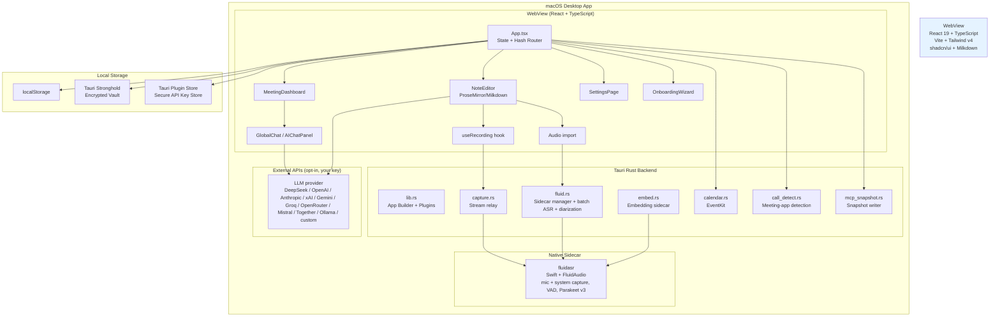
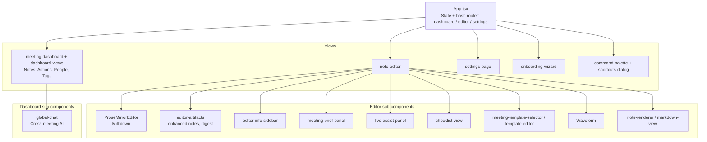
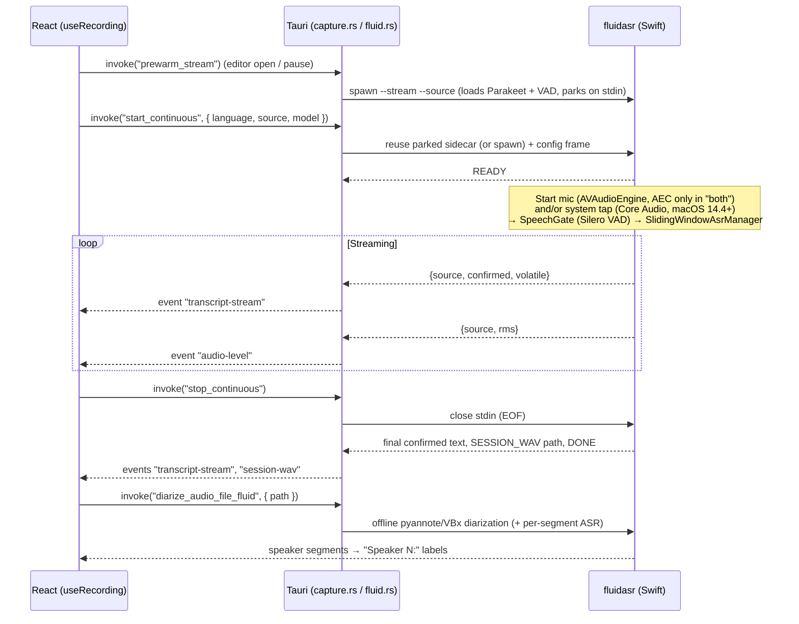
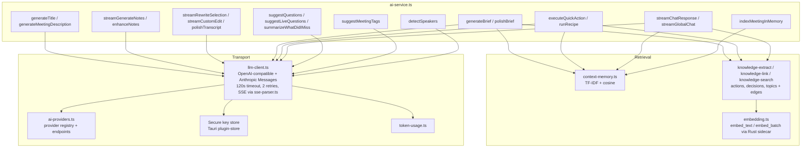
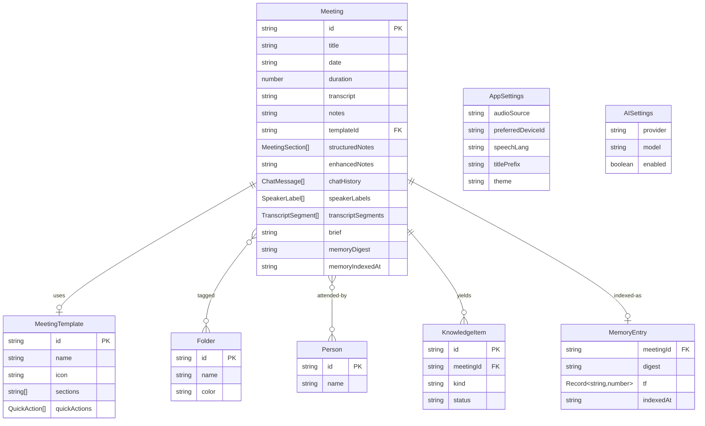

# Myna Notes — Architecture

## System Overview



## Frontend Component Architecture



Shared primitives live in `src/components/ui/` (shadcn/ui on Base UI + Radix). `error-boundary.tsx` wraps the app shell.

## Recording & Transcription Pipeline

All audio capture and recognition happens inside the Swift `fluidasr` sidecar. The Rust layer only relays events; no audio crosses the process boundary.



Key behaviors:

- **Sources:** `mic`, `system`, or `both`. In `both`, `stream-transcript.ts` interleaves the two feeds with `Me:` / `Them:` labels (renamable live).
- **SpeechGate:** Silero VAD + energy floor with pre-roll and hangover. The mic gate is more permissive than the system gate.
- **Lossless streaming:** confirmation thresholds are zero so no window's text is dropped; final text is the streamed confirmed text plus the leftover volatile tail (never `finish()`'s re-decode, which would duplicate).
- **Pre-warm:** a parked sidecar holds the model but captures nothing; it expires after 120 s. `useRecording.prewarm()` runs when the editor opens and on pause.
- **Stop:** Rust closes stdin and waits up to 6 s for `DONE`.
- **Session WAV:** the sidecar writes a 16 kHz WAV (system audio if active, else mic; at least ~2 s) for post-stop diarization.
- **Audio import:** `import-audio.ts` calls `diarize_audio_file_fluid` (with ASR) or falls back to `transcribe_audio_file_fluid`. Supported extensions: mp3, m4a, wav, aac, aiff, caf, flac, ogg, mp4, mov.

## AI Service Architecture



Supported providers (`ai-providers.ts`): DeepSeek, OpenAI, xAI, Anthropic, Gemini, Groq, OpenRouter, Mistral, Together AI, Ollama, and a custom OpenAI-compatible endpoint. `deepseek-client.ts` is a back-compat alias layer over `llm-client.ts`.

Other AI-adjacent modules: `auto-tag.ts` (apply suggested tags), `catch-up.ts`, `chat-actions.ts`, `citations.ts`, `dictionary.ts` (spelling + protected names), `meeting-brief.ts`, `meeting-content.ts` (single source for assembling meeting text), `speakers.ts`.

## Storage Architecture

Data is held in `localStorage` (synchronous reads) and mirrored to an encrypted Stronghold vault.

- **Write path:** each `save*` / `upsert*` helper in `storage.ts` writes `localStorage`, then persists to Stronghold (`persist`, errors logged not thrown).
- **Startup:** `hydrateFromVault()` reads every key in `ALL_KEYS` from Stronghold into `localStorage` before the app loads.
- **Vault password:** generated randomly on first launch (`stronghold.ts`) and stored in the Tauri plugin-store file `meeting-notes-secure.json`. The Rust side derives the vault key from it with a salted, iterated SHA-256.
- **API keys and the Slack webhook URL** live only in the Tauri plugin-store. `saveApiKey` fails closed rather than falling back to `localStorage`; a legacy plaintext key is migrated once and removed.
- **Keys stored:** meetings, settings, AI settings, templates, memory index, knowledge graph, dictionary, snippets, folders (tags), recipes, people, token usage. Sort preference and saved searches are `localStorage` only.
- **MCP snapshot:** `writeMcpSnapshot()` sends a JSON snapshot to `write_mcp_snapshot`, which writes `meetings-mcp-snapshot.json` into the app data dir for the MCP server.

## Backend Invoke Commands

| Module | Commands |
| --- | --- |
| `capture.rs` | `start_continuous`, `stop_continuous` |
| `fluid.rs` (streaming) | `prewarm_stream` |
| `fluid.rs` (batch) | `transcribe_audio_fluid`, `transcribe_audio_file_fluid`, `diarize_audio_file_fluid` |
| `fluid.rs` (models) | `check_fluid_ready`, `setup_fluid`, `setup_fluid_model`, `download_model`, `cancel_model_setup`, `model_setup_status`, `unload_fluid`, `fluid_loaded`, `model_storage_info`, `delete_model` |
| `fluid.rs` (permissions) | `check_screen_permission`, `request_screen_permission` |
| `embed.rs` | `embed_text`, `embed_batch`, `unload_embed` |
| `calendar.rs` | `request_calendar_access`, `list_upcoming_events`, `calendar_authorization_status` |
| `call_detect.rs` | `detect_call_apps` |
| `mcp_snapshot.rs` | `write_mcp_snapshot`, `mcp_snapshot_path` |

Events emitted to the webview: `transcript-stream`, `audio-level`, `capture-error`, `session-wav`, `fluid-model-progress`, `quick-capture` (global shortcut ⌘⇧N). The webview emits `recording-state`, which `lib.rs` uses to update the tray tooltip.

Plugins: opener, store, dialog, fs, log, stronghold, single-instance, window-state, global-shortcut. The tray menu has Show / Recording status / Quit; Quit stops capture and unloads the sidecars first.

Debug builds honor `FLUID_SIDECAR_BIN` to point at a different sidecar binary.

## Data Model



## File Map

```
myna-notes/
├── src/                            # React frontend
│   ├── App.tsx                     # Root state, hash routing (#dashboard, #editor/<id>, #settings)
│   ├── main.tsx, types.ts, index.css
│   ├── components/                 # Views + editor/dashboard pieces (see diagram above)
│   │   └── ui/                     # shadcn/ui primitives
│   └── lib/
│       ├── ai-service.ts, llm-client.ts, ai-providers.ts, deepseek-client.ts, sse-parser.ts, token-usage.ts
│       ├── context-memory.ts, embedding.ts, knowledge-{extract,link,search}.ts, citations.ts
│       ├── use-recording.ts, stream-transcript.ts, diarize.ts, import-audio.ts, speakers.ts
│       ├── storage.ts, stronghold.ts
│       ├── meeting-content.ts, meeting-brief.ts, catch-up.ts, auto-tag.ts, chat-actions.ts, checklist.ts
│       ├── dictionary.ts, templates.ts, export.ts, share.ts, import-meetings.ts, sidebar-people.ts
│       └── use-{chat,theme,audio-devices,permissions}.ts, onboarding.ts, app-meta.ts, utils.ts, ...
├── src-tauri/                      # Rust backend
│   ├── src/{main,lib,capture,fluid,embed,calendar,call_detect,mcp_snapshot}.rs
│   ├── binaries/fluidasr-aarch64-apple-darwin   # bundled sidecar
│   ├── capabilities/default.json, Entitlements.plist, Info.plist, tauri.conf.json
│   └── icons/
├── fluid-sidecar/                  # Swift sidecar (FluidAudio): capture, VAD, ASR, diarization
├── mcp-server/                     # Rust stdio MCP server reading the snapshot
├── scripts/                        # build-sidecar.sh, package-unsigned.sh, install.sh, process.ts
├── docs/                           # architecture.md, architecture-review.md, images/
├── LAUNCH.md, README.md
└── vite.config.ts, tsconfig*.json, package.json
```
